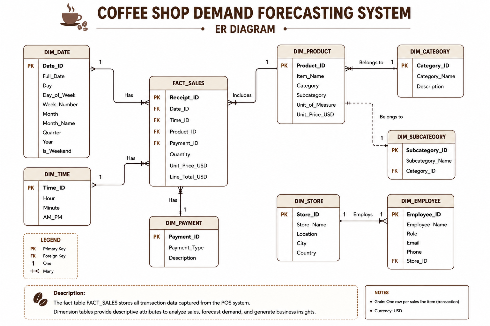

# ☕ Coffee Shop Demand Forecasting Dashboard

AI-powered demand forecasting system for coffee shops using **Meta Prophet**, **Gradio**, **Plotly**, and **Python** to predict future sales trends and optimize business decisions.
<p align="center">
  
</p>


## 📖 Project Overview

This project uses historical Point-of-Sale (POS) transaction data to forecast future coffee shop sales and product demand. The forecasting model is built using Facebook Meta Prophet and presented through an interactive Gradio dashboard.

The solution helps business owners make better decisions regarding inventory management, staffing, and sales planning by identifying trends and seasonality in customer purchasing behavior.

## 🎯 Business Problem

Coffee shops often face:

- Overstocking inventory
- Running out of popular items
- Unpredictable customer demand
- Revenue fluctuations
- Difficult staff scheduling

  ## 🎨 UI/UX Prototype

The project also includes a customer-facing Coffee Shop Management System
UI/UX prototype designed using **Balsamiq Wireframes**.

The prototype focuses on the customer ordering journey, from browsing the
coffee shop menu to placing and tracking an order.

---

 ## 🎥 UI/UX Prototype Demo

A video walkthrough demonstrating the Coffee Shop Customer Ordering System UI/UX prototype and the complete customer ordering flow.

▶️ **[Watch the UI/UX Prototype Demo on Google Drive](https://drive.google.com/file/d/1VFxhYApmG_H8Edv6c0TttdLfJUiCxrF_/view?usp=sharing)**
## 🎥 UI/UX Prototype Demo

A short walkthrough demonstrating the Coffee Shop Management System UI/UX
prototype and customer ordering flow.

[▶️ Watch the UI/UX Prototype Demo](YOUR_VIDEO_LINK)

### 📱 Main Screens

The prototype includes:

- Home
- Menu
- Product Details
- Shopping Cart
- Checkout
- Review & Place Order
- Order Confirmation
- Order Tracking
- My Orders
- Register
- My Profile
- Edit Profile

### 🔄 Customer Ordering Flow

```text
Home
  ↓
Menu
  ↓
Product Details
  ↓
Shopping Cart
  ↓
Checkout
  ↓
Review & Place Order
  ↓
Order Confirmation
  ↓
Order Tracking

Without forecasting, these challenges can lead to increased costs and reduced customer satisfaction.


## 🎯 Project Objectives

- Forecast weekly revenue
- Predict demand for individual menu items
- Identify weekly and yearly seasonal patterns
- Support inventory optimization
- Improve operational decision-making

## ✨ Features

- AI-powered sales forecasting
- Interactive Gradio dashboard
- Revenue forecasting
- Product demand forecasting
- Confidence interval visualization
- - Weekly & yearly seasonality detection
- Interactive Plotly charts


## 🏗️ System Architecture

<p align="center">

</p>

## 🔄 Project Workflow

<p align="center">

</p>

## 👤 Use Case Diagram

<p align="center">

</p>

## 🗄️ Entity Relationship Diagram

<p align="center">

</p>
  
